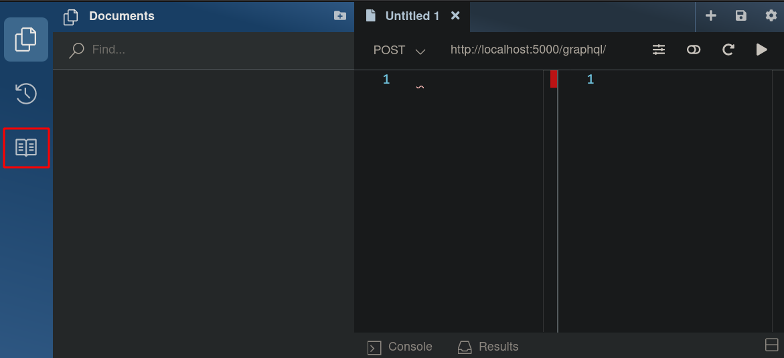
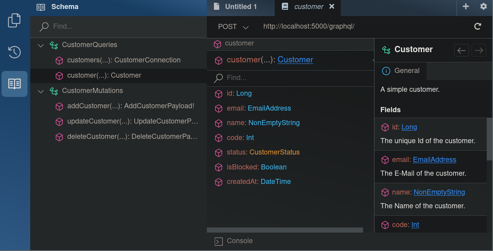

# Code Challenge Customer Service

A simple service maintaining customers via a GraphQL API and MSSQL server.

[](https://github.com/BroderPeters/customer-service/actions/workflows/tests.yml) [](https://github.com/BroderPeters/customer-service/actions/workflows/docker-build.yml)

## Setup

### Requirements

- `docker` and `docker-compose`
- Dotnet SDK and Runtime (_For debugging or "direct" execution_)

Following versions have been used during development on a Linux based machine:

```bash
> docker --version
Docker version 20.10.6, build 370c28948e

> docker-compose --version
docker-compose version 1.29.2

> dotnet --version
5.0.203
```

### Getting started

---

**Note**

You can use the `-d` option for the docker commands to start up the containers silently.

If you need logs for troubleshooting `docker logs <container-id>` is your way to go.

Tear down the containers you can use `docker-compose down -v`.

---

### Docker only

To setup the service only using Docker execute the following:

1. Start all necessary containers with `docker-compose up`
2. Continue [here](#use-the-service)

### Debugging or "direct" execution

To debug or either directly execute the service follow these steps:

1. Start the database using `docker-compose up sqlserver`
2. Open the project in your favorite IDE and start debugging or executing the project.

   or

3. `dotnet build` and `dotnet run --project src` to build and run the service with the dotnet SDK and Runtime
4. Continue [here](#use-the-service)

### Use the service

To play around and explore the GraphQL API open http://localhost:5000/graphql/ in your favorite internet browser.

To access the schema documentation navigate through the left menu and click the book button.



Here you can visit the available queries and mutations.



#### Example queries and mutations

<details>
    <summary>Adding a customer</summary>

    mutation AddJohnDoe {
        addCustomer(input: {
            name: "John Doe",
            email: "john.doe@mail.com"
            code: 1,
            status: ACTIVE,
            isBlocked: false
        }) {
            customer {
                id
                },
            errors {
                code,
                message
            }
        }
    }

</details>

<details>
    <summary>Querying a customer</summary>
  
    query GetAllCustomersPaginated {
        customers {
            edges {
                node {
                    id,
                    name,
                    email,
                    code,
                    status,
                    isBlocked,
                    createdAt
                }
            }
        }
    }

    query GetCustomerById {
        customer(id: 1) {
            id,
            name,
            email,
            code,
            status,
            isBlocked,
            createdAt
        }
    }

</details>

<details>
    <summary>Updating a customer</summary>

    mutation UpdateJohnDoe {
        updateCustomer(input: {
            id: 1,
            name: "Doe John",
            email: "doe.john@mail.com",
            code: null,
            status: INACTIVE,
            isBlocked: true
        }) {
            customer {
                name,
                email,
                code,
                status,
                isBlocked
            },
            errors {
                code,
                message
            }
        }
    }

</details>

<details>
    <summary>Deleting a customer</summary>

    mutation DeleteCustomerById {
        deleteCustomer(input: {
            id: 1
        }) {
            customer {
                id,
                name,
                email,
                code,
                status,
                isBlocked
            },
            errors {
                code,
                message
            }
        }
    }

</details>

## Additional thoughts and possible troubleshoots

### Database

As the assignment only said `Use SQL Server as database` and I wasn't sure whether it meant MSSQL or just a relational database in general, I was going with MSSQL to be save.

Besides that I think it wouldn't have made a huge difference if any other relational database would've been used.

### Visual Studio StyleCopAnalyzer

If you're using Visual Studio older then VS2019 to inspect the project you might run into errors in terms of the StyleCopAnalyzer. Therefore check [this section](https://github.com/DotNetAnalyzers/StyleCopAnalyzers#c-language-versions) and downgrade the version in the `csproj`.

### Docker network issues

By personal experience it can happen that the network address from the connection string for the MSSQL server causes issues on Windows systems. Please remember that the project was created on a Linux machine.

A common workaround is to try `127.0.0.1` instead of `localhost`. You can adjust this value in the [appsettings.json](src/appsettings.json).
